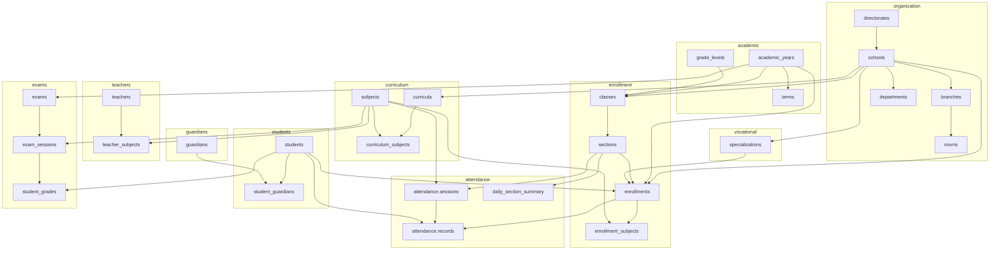
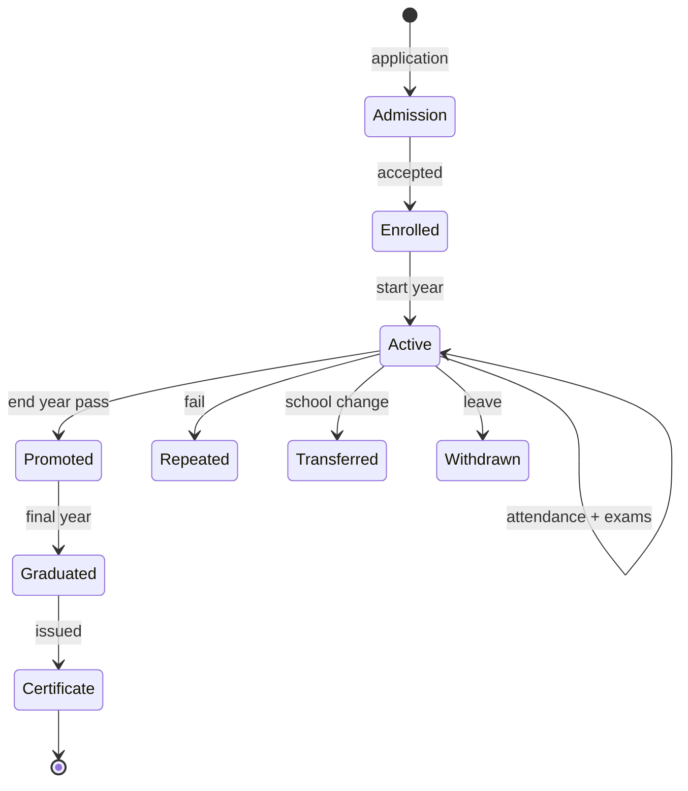
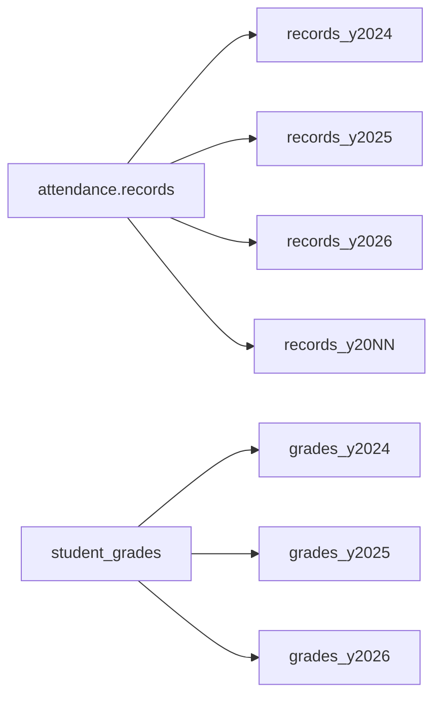
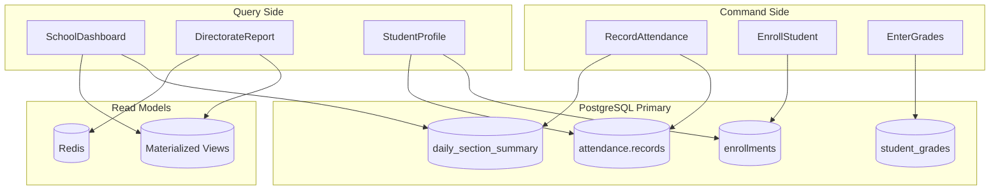

# ERD Overview — Entity Relationship Diagram

> **Authoritative detail:** [database-blueprint.md](./database-blueprint.md) (87 blueprint objects)  
> **Dictionary:** [database-dictionary.md](./database-dictionary.md)

## Core Domain Flow



---

## Student Lifecycle ERD



---

## Key Relationships (Cardinality)

| From | To | Type | Notes |
|------|-----|------|-------|
| directorates | schools | 1:N | 20 schools per province |
| schools | sections | 1:N via classes | 45 sections/school |
| students | enrollments | 1:N | One per year |
| enrollments | enrollment_subjects | 1:N | ~15 subjects |
| sections | enrollments | 1:N | 50 students/section |
| students | attendance.records | 1:N | Millions over years |
| exam_sessions | student_grades | 1:N | One grade per student |
| students | guardians | N:M | student_guardians |

---

## Schema Dependency Order (Migration)

```
1. organization, academic
2. security
3. students, guardians, vocational, curriculum
4. teachers, enrollment
5. timetable, attendance
6. exams, results, promotion, transfers, graduation
7. finance, communication, workflow, documents, audit
8. reports (materialized views)
```

---

## Partition Boundaries



---

## Read vs Write Paths (CQRS-Lite)



---

## Related

- [database-blueprint.md](./database-blueprint.md)
- [database-dictionary.md](./database-dictionary.md)
- [normalization-and-cqrs.md](./normalization-and-cqrs.md)
- [student-lifecycle.md](../brain/student-lifecycle.md)
