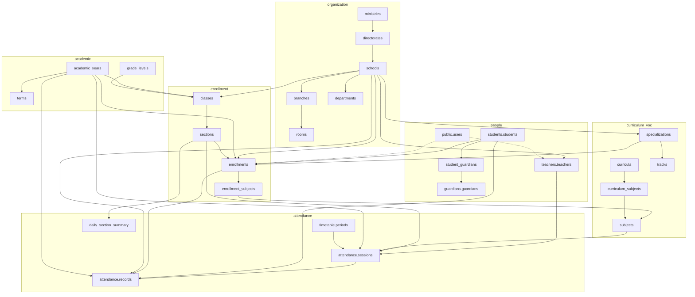

# 03 — Relationship Map

**Status:** Phase 0  
**Scope:** Implemented relationships (LIVE) + planned critical relationships (BP/ERP)  
**Delete rule default:** `ON DELETE RESTRICT` for academic/history edges; CASCADE only for disposable dependents (explicitly justified)

---

## 1. Core LIVE relationship graph



Dashed lines: optional/nullable actor FKs (`user_id`, `enrolled_by`, etc.).

---

## 2. LIVE cardinality (selected)

| Parent | Child | Card. | ON DELETE | Notes |
|--------|-------|-------|-----------|-------|
| organization.ministries | directorates | 1:N | RESTRICT | |
| organization.directorates | schools | 1:N | RESTRICT | Tenant ancestors |
| organization.schools | branches, departments, rooms* | 1:N | RESTRICT | *rooms via branch |
| organization.schools | students.students | 1:N | RESTRICT | school_id added post-create |
| academic.academic_years | terms, holidays, classes, enrollments, sessions, records | 1:N | RESTRICT | Year scope |
| students.students | contacts, addresses, enrollments, records, student_guardians | 1:N | RESTRICT | |
| guardians.guardians | student_guardians, addresses | 1:N | RESTRICT | |
| enrollment.classes | sections | 1:N | RESTRICT | |
| enrollment.sections | enrollments, sessions, daily_section_summary | 1:N | RESTRICT | |
| enrollment.enrollments | enrollment_subjects, records | 1:N | RESTRICT | RLS on parent |
| curriculum.subjects | curriculum_subjects, sessions, teacher_subjects | 1:N | RESTRICT | |
| teachers.teachers | teacher_schools, teacher_subjects, qualifications, sessions | 1:N | RESTRICT | |
| attendance.sessions | records | 1:N | RESTRICT | |
| public.users | user_roles, passkeys, security_audit_logs | 1:N | RESTRICT / CASCADE(passkeys) | |
| intelligence.recommendations | human_feedback_events | 1:N | CASCADE | Non-academic |

---

## 3. Admission relationships (Phase 2 LIVE)

```text
organization.schools ──┐
academic.academic_years ─┼─► admission.application_periods
                         │
academic.grade_levels ──────► admission.applications
vocational.specializations ─► admission.applications (nullable)
public.users ───────────────► admission.applications.reviewed_by (nullable)
students.students ──────────► admission.applications.student_id (nullable, conversion only)
admission.applications ─────► admission.application_documents
```

Waitlist = `applications.status = 5`. Interviews / status_history tables deferred.

---

## 4. Planned BP relationships (not LIVE)

```text
admission.applications → students (on convert, nullable student_id) / via period → schools / academic_years
exams.exams → schools, academic_years, exam_types
exams.exam_sessions → exams, subjects, sections
exams.student_grades → students, enrollments, exam_sessions, academic_years, schools
results.* → enrollments / students / academic_years
finance.student_fees → students, fee_types, academic_years
finance.payments → student_fees
finance.transactions → payments (immutable trail)
documents.files → polymorphic or typed owners (student/employee)
timetable.schedules → sections, subjects, teachers, rooms, periods
  + block: start_period..end_period occupying contiguous periods
workflow.approval_requests → approval_flows + subject entity
audit.audit_logs → actor user + entity reference
```

**Grade mutation rule:** corrections create history rows or versioned events — never silent overwrite without audit.

---

## 4. Planned ERP integration edges

```text
hr.employees ──user_id──► public.users
hr.payroll_items ───────► finance.journal_entry_lines
inventory.stock_issues ─► finance + vocational workshops
facilities.maintenance ─► inventory consumption + optional volunteer logs
internship.placements ──► students + partners + optional enrollment/course
medical.* ──────────────► students (HIGHLY_RESTRICTED; no teacher default access)
behavior.incidents ─────► students + actors
activities.duty_assignments ↔ conflict with timetable.schedules + hr.leaves
transportation.subscriptions ► students
```

---

## 5. Conflict-detection relationships (vocational scheduling)

Logical conflicts (enforced later via EXCLUDE/constraints/app):

| Resource | Overlap dimension |
|----------|-------------------|
| Teacher | school calendar + period range |
| Room / workshop | period range + safety capacity |
| Section / batch | period range |
| Duty roster | vs teaching block + leave |

Block scheduling occupies **all periods from start_period through end_period** as one logical assignment.

---

## 6. RLS-relevant edges

Any child carrying `school_id` (or inheriting via enrollment/session) must be reviewed for RLS. Today:

| Table | Policy key |
|-------|------------|
| enrollment.enrollments | `school_id = app.current_school_id` |
| attendance.records | `school_id = app.current_school_id` |

Priority expansions: `students.students`, classes/sections, teachers, future grades/fees/medical.

---

## 7. Anti-patterns to avoid

- Parallel FK graphs for the same fact (two enrollment tables)  
- CASCADE from school → students/enrollments/grades  
- Polymorphic FKs without CHECK + partial indexes justification  
- Cross-linking intelligence tables into grade/enrollment update paths  

---

## 8. Next ERD deliverable

After Phase 1+ implementation slices, generate `docs/database/SIS-ERD.md` from the **live** catalog (dbdiagram or Mermaid) so the diagram never drifts from PostgreSQL.
